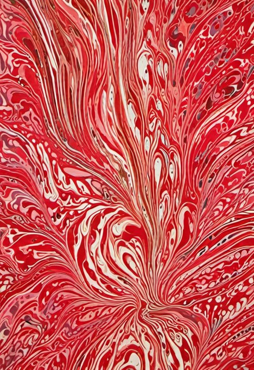
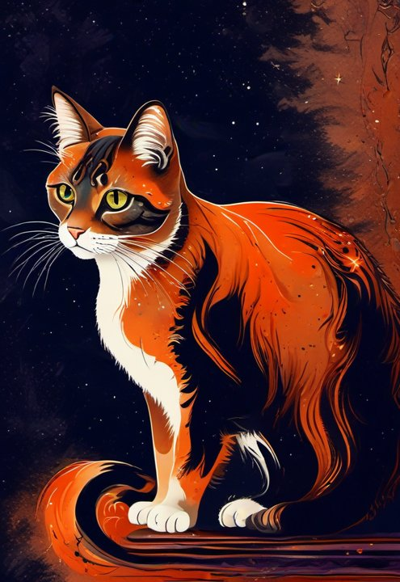
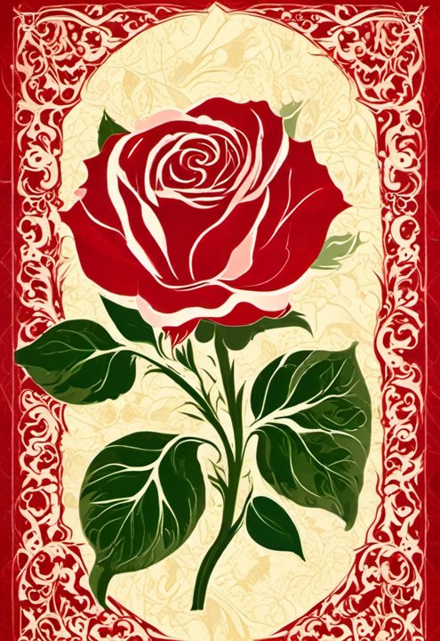

# Ebru AI

Geleneksel Türk ebru sanatını Stable Diffusion ile üreten bir sistem:
Android uygulaması, Flask sunucusu ve web arayüzü.

Kullanıcı renk paleti ve desen seçer, isterse somut bir nesne yazar
(araba, kedi, gül); sunucu bunu İngilizce bir prompt'a çevirip kendi
eğittiğimiz ebru LoRA'sı ile SDXL üzerinde üretir. Sonuç doğrudan
telefonun duvar kağıdı yapılabilir.

<p align="center">
  
  
  
  
  
</p>

## Nasıl çalışıyor

```
Telefon / Tarayıcı  ──HTTPS──>  Flask  ──HTTP──>  Stable Diffusion (A1111)
                                 │                 GPU burada
                                 └─ prompt motoru, kuyruk, hesaplar
```

Flask GPU kullanmıyor; Türkçe isteği zenginleştirilmiş bir prompt'a
çevirip A1111'e iletiyor, sırayı ve kullanım haklarını yönetiyor.

### Prompt motoru

Kullanıcının yazdığı Türkçe metin sözlüklerle eşleştiriliyor: nesneler,
desenler, renk paletleri ve hareketler. Eşleşmeyen kısım çevriliyor.

Türkçe karakter toleranslı: `kus`, `agac`, `ucan` da eşleşiyor.

Somut bir nesne istendiğinde prompt dengesi otomatik değişiyor —
nesnenin ağırlığı artıyor, ebru tarifi kısalıyor, desen komutu
kaldırılıyor ve LoRA ağırlığına tavan konuyor. Bu ayarlar deneyerek
bulundu: aksi halde ebru dokusu nesneyi tamamen örtüyordu.

| | Nesne yok | Nesne var |
|---|---|---|
| Nesne ağırlığı | — | 1.55 |
| Desen tarifi | 1.2 | çıkarılır |
| Ebru tanımı | 12 ifade | 3 ifade |
| LoRA ağırlığı | 0.30–0.90 (kullanıcı seçer) | en fazla 0.60 |

### Asenkron üretim

Bir görsel ~95 saniye sürüyor, tüneller ise genelde ~100 saniyede
bağlantıyı kesiyor. Bu yüzden üretim iş kuyruğu üzerinden yapılıyor:

```
POST /jobs        → 202, {"job_id": "..."}
GET  /jobs/<id>   → durum, ilerleme; bittiğinde görsel
```

Uygulama kapatılsa bile sunucu işi tamamlıyor; uygulama açılınca
sonucu alıp galeriye kaydediyor.

## Klasörler

```
mobile/    Flutter uygulaması (Android)
server/    Flask sunucusu, prompt motoru, hesap yönetimi
web/       Web arayüzü (şablonlar, css, js)
ornekler/  Üretilmiş örnek çıktılar
```

## Kurulum

### Gereksinimler

- Python 3.10+
- Flutter 3.35+
- [AUTOMATIC1111 Stable Diffusion WebUI](https://github.com/AUTOMATIC1111/stable-diffusion-webui)
- [SDXL base 1.0](https://huggingface.co/stabilityai/stable-diffusion-xl-base-1.0)
- **Ebru LoRA** — bu proje için eğitildi, ayrı olarak yayımlandı:
  [enestum2/ebru-lora-sdxl](https://huggingface.co/enestum2/ebru-lora-sdxl)
- İsteğe bağlı: [SDXL-Lightning 4 adım LoRA](https://huggingface.co/ByteDance/SDXL-Lightning)
  — üretimi ~4 kat hızlandırıyor

### Modelleri yerleştirme

Model dosyaları boyutları nedeniyle depoda yok. İndirip A1111'in
klasörlerine koy:

```
stable-diffusion-webui/
├─ models/Stable-diffusion/
│  └─ sd_xl_base_1.0.safetensors
└─ models/Lora/
   ├─ ebru_projesi-01.safetensors            ← ebru LoRA'sı
   └─ sdxl_lightning_4step_lora.safetensors  ← isteğe bağlı, hız için
```

Lightning dosyası varsa sunucu bunu kendiliğinden algılayıp 4 adımlı
hızlı üretime geçer; yoksa 16 adımlı klasik ayarı kullanır.

### Sunucu

```bash
cd server
python -m venv venv
venv\Scripts\pip install -r requirements.txt
copy ..\.env.example ..\.env
```

`.env` dosyasını doldur, sonra:

```bash
venv\Scripts\python app.py
```

A1111'i `--api` bayrağıyla başlatmayı unutma:

```bash
webui-user.bat
# COMMANDLINE_ARGS=--medvram-sdxl --xformers --api
```

`sunucu_baslat.bat` üçünü birden (A1111, Flask, tünel) açar.

### Uygulama

```bash
cd mobile
flutter pub get
flutter build apk --release
```

Sunucu adresini `lib/services/settings_service.dart` içindeki
`defaultServerUrl` değerinde ayarla.

### Dağıtım

Sunucunun internetten erişilebilir olması gerekiyor. Ücretsiz yol:
Tailscale Funnel ya da Cloudflare Tunnel. Ayrıntılar
[server/DAGITIM.md](server/DAGITIM.md) içinde.

## Güvenlik

- Şifreler `scrypt` ile hash'lenerek saklanıyor, düz metin tutulmuyor
- Oturumlar rastgele anahtarla, 90 gün geçerli; çıkışta iptal ediliyor
- "Kullanıcı yok" ve "şifre yanlış" aynı mesajı veriyor
- Yönetim uçları yalnızca yönetici hesabına açık
- Kullanım hakları veritabanında; uygulamayı silip kurmak sıfırlamıyor
- `EBRU_DEBUG` varsayılan kapalı — Werkzeug hata ayıklayıcısı ağa
  açıldığında uzaktan kod çalıştırmaya izin verebiliyor

**Depoda olmayanlar:** veritabanı (`*.db`), ortam değişkenleri
(`.env`), günlükler, derlenmiş APK ve model dosyaları.

## Bilinen sınırlar

- Tek GPU: üretimler sıraya giriyor, eşzamanlı çalışmıyor
- 6 GB VRAM'de SDXL sınırda; çözünürlük buna göre seçildi (704×1024)
- Uygulama tamamen kapalıyken bildirim gelmiyor (sonuç açılışta alınıyor)
- Nesne sözlüğü sınırlı: listede olmayan bir nesne istenirse ebru
  dokusu onu bastırabiliyor
- Keşfet sekmesi yerel bir vitrin; paylaşımlı akış için sunucu tarafında
  görsel saklama gerekiyor

## Ebru LoRA'sı hakkında

Model bu proje için sıfırdan eğitildi:

| | |
|---|---|
| Taban | Stable Diffusion XL 1.0 |
| Veri seti | 95 görsel (1024×1024), proje ekibince hazırlandı |
| Tetikleyici kelimeler | `ebru_style, marble texture, liquid art` |
| Network Dim / Alpha | 32 / 16 |
| Altyapı | Kohya_ss (Hollowstrawberry) |

Ayrıntılar ve kullanım önerileri [model kartında](https://huggingface.co/enestum2/ebru-lora-sdxl).

## Lisans

Kod: MIT — bkz. [LICENSE](LICENSE).

Ebru LoRA'sı `creativeml-openrail-m` ile ayrı olarak yayımlanıyor.
Üretilen görseller bu lisansların kapsamı dışındadır.
